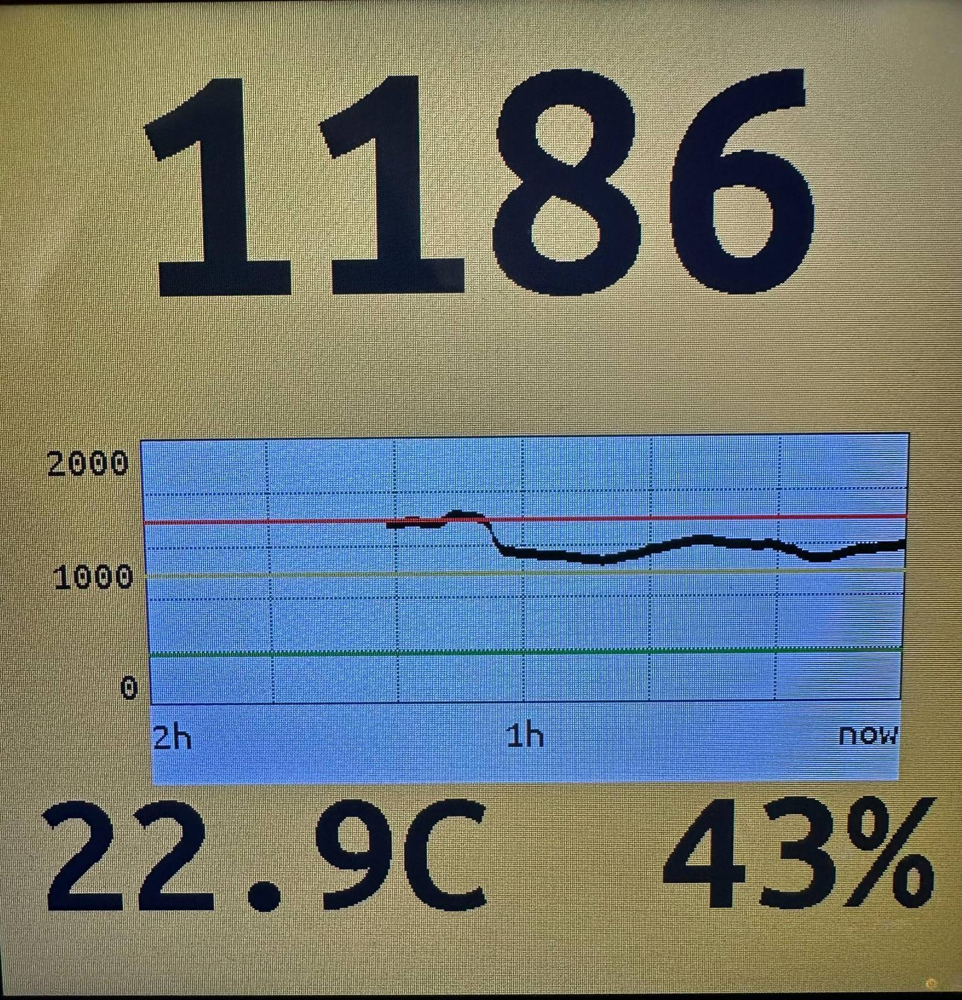

# SenseCAP Indicator D1S ESPHome Configuration

ESPHome configuration for the [SenseCAP Indicator D1S](https://www.seeedstudio.com/SenseCAP-Indicator-D1S-p-5645.html) - an ESP32-S3 device with a 480x480 LCD display and environmental sensors.




## Features

- **CO2 monitoring** with color-coded display (green/amber/red based on levels)
- **Temperature & humidity** from AHT41 sensor
- **2-hour CO2 graph** with threshold lines
- **Auto brightness** adjustment at sunrise/sunset
- **Button control** for manual brightness cycling
- **OTA updates** and web server interface

## Sensors

Communicates with the RP2040 co-processor via UART to read:
- SCD41 (CO2)
- SGP40 (TVOC)
- AHT41 (Temperature/Humidity)

## Usage

```bash
esphome run indicator_d1s.yaml
```

Requires `secrets.yml` with `wifi_ssid` and `wifi_password`.
